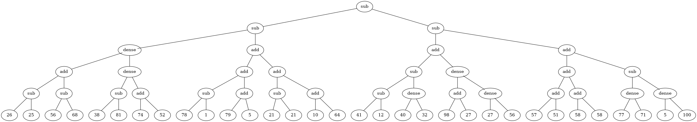
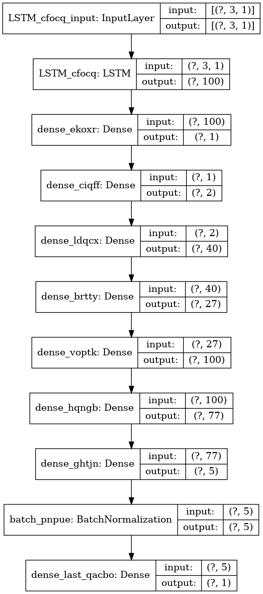

PrAsE
========================

Predictive Asynchronous Evolutionary Builder for Artificial Intelligence

         </----\>______
         /. .  /       \
        ( ' ) /        @
         `-._/        /
            )--)__--( >
            ''''   ''''


## Dependencies

Tested with:

```
numpy==1.18.5
deap==1.3.1
tensorflow-cpu==2.3.0
pygraphviz==1.9
```

## Objects

There are three kinds of objects:

1.) gods - multithreaded genetic programming
2.) spirits - neural networks / models
3.) prophets - interface for spirits, data keepers


## Workflow

Usually, the flow of the code is following:

1.) Instantiate a god with parameters

2.) Instantiate a prophet with parameters (a spirit is automatically added)

3.) Check if the prophet is inspired (the model is already built and ready)

4.) Prophet should observe a real-time data stream, which can be all kinds of events such as security alerts, logs etc.

5.) Prophet should meditate to automatically prepare training and testing datasets

6.) God should inspire a prophet, build the model inside the prophet's spirit

7.) Prophet should make predictions based on a small portion of previous or expected events

Both the result of the evolutionary algorithm (see on the picture) and the model layers can be printed to files using `draw()` methods.



See the code and comments in `template.py`


## Example

The sample code is available in `template.py`, that you can immediately use to build your own application.

The code features a god object and a prophet object:

```language python
# Evolutionary algorithm
apollo = prase.God(generations_count=5)

# Neural networks and data storage
pythia = prase.TimeProphet(
	name="pythia",
	timestamp_field="timestamp",
	span=3,
	resolution=10
)
```

The god creates a genetic programming algorithm for 5 generations, while the prophet incorporates
a spirit with a LSTM (Long short-term memory) neural network. The idea is, that the prophet
should automatically decide which spirit is build based on the parameters (here: `timestamp_field` and `span`).

The prophet then observes the real-time data streams with documents, where each of them features the `timestamp_field`.

Then, ideally periodically or using some publish subscribe mechanism, the prophet should get inspired (the model should be built), so that it can make predictions.

```language python
# Transform the observed data into data suitable for the model
print("Pythia is meditating.")
pythia.meditate()

# Create, train, test and save the neural network model using genetic programming
print("Pythia is getting inspired by Apollo.")

loop.run_until_complete(
	apollo.inspire(pythia)
)
```

## Example of a built neural network model




## Further development

Other kinds of gods, spirits and prophets (currently there is `TimeProphet` and `LSTMSpirit`) need to be added.

Other examples next to the template need to be added, tested and evaluated.

Statistical functions and models. Include TensorFlow Probability:
https://github.com/tensorflow/probability/blob/main/tensorflow_probability/examples/jupyter_notebooks/Structural_Time_Series_Modeling_Case_Studies_Atmospheric_CO2_and_Electricity_Demand.ipynb
